# Qreeket

A mobile application platform for tertiary students to communicate, collaborate and share ideas with each other.

### App State

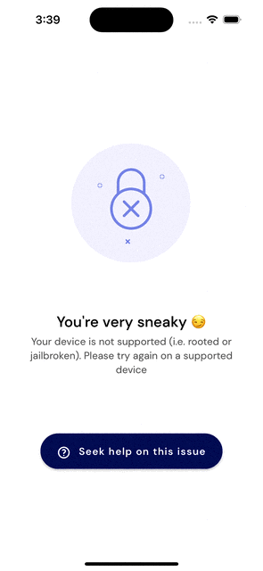

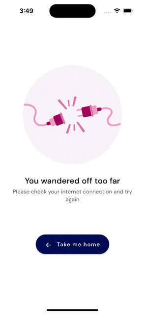

[//]: # (

)

[//]: # (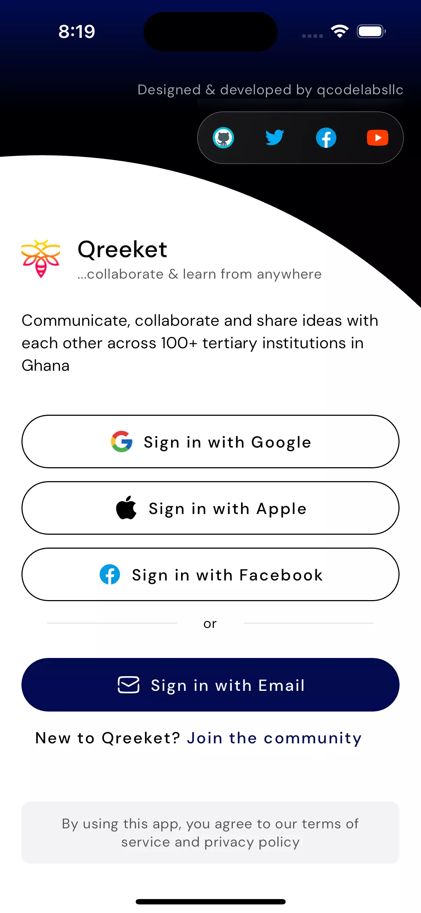)

 

### Onboarding

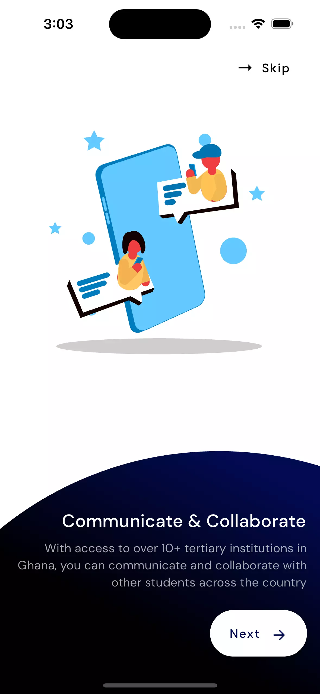

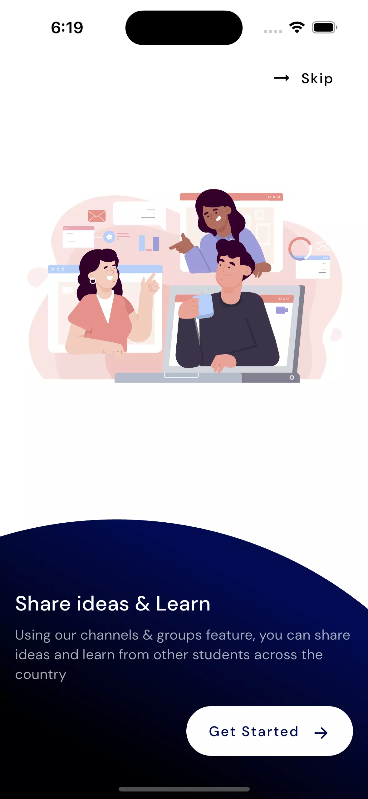

 

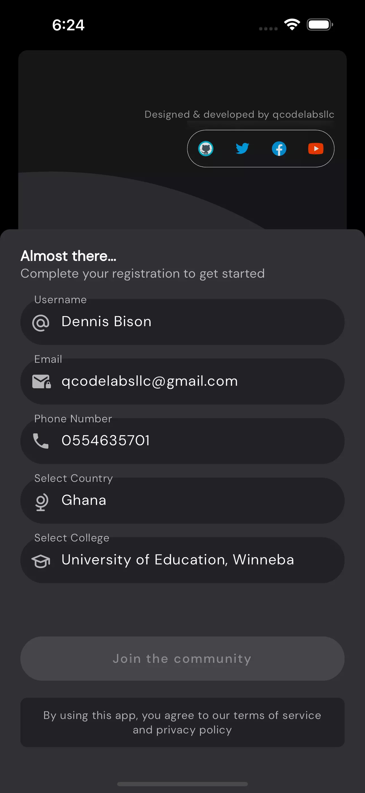

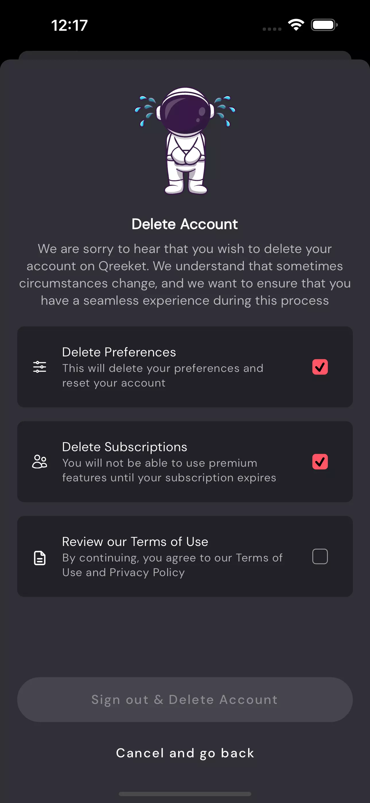

 

### Login

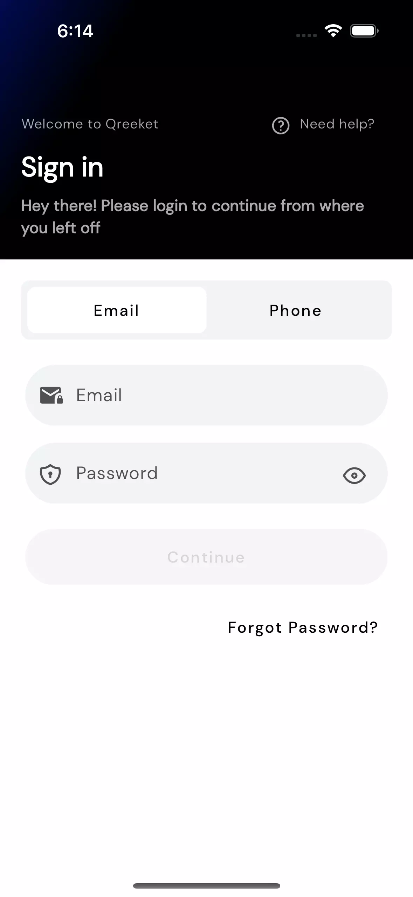

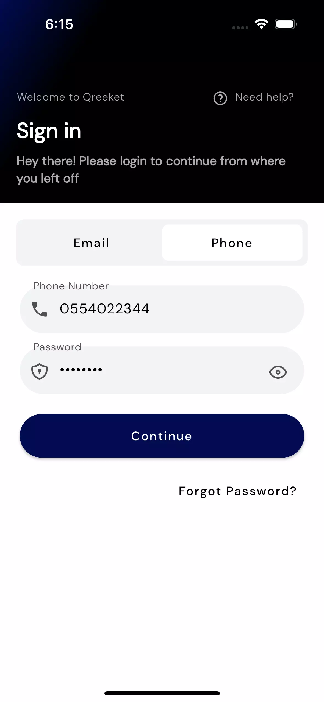

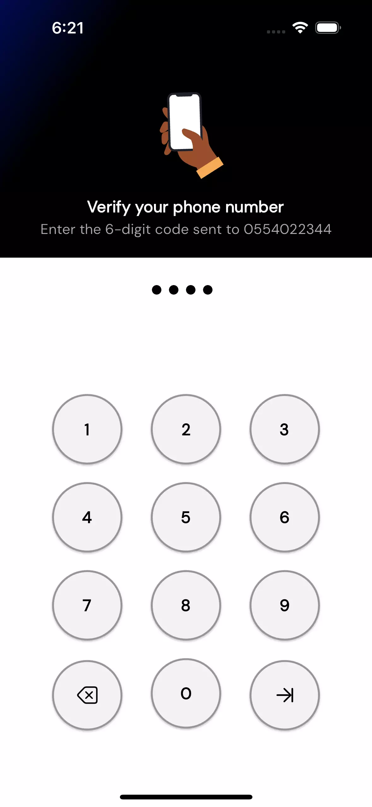

 

### Create Account

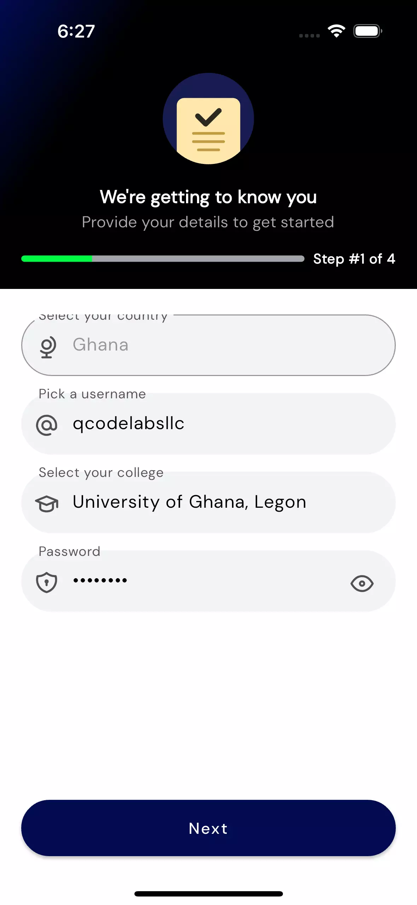

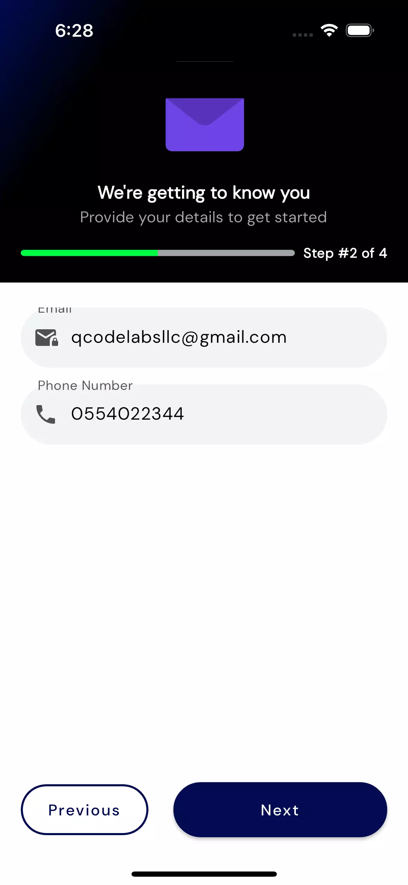

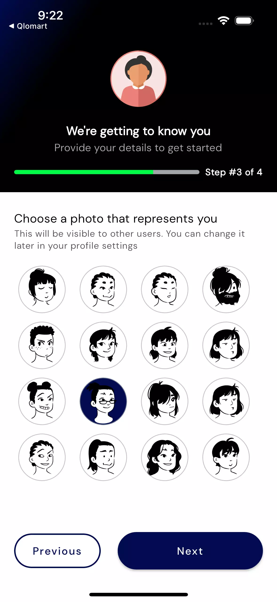

 

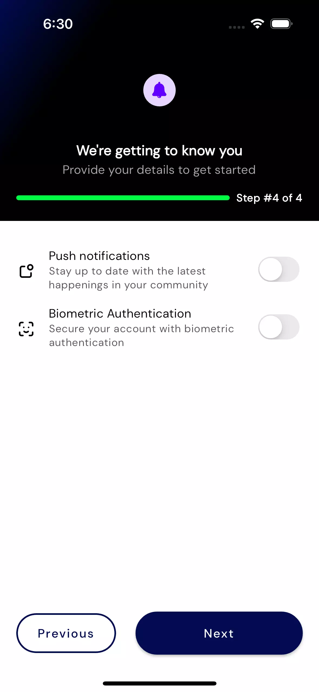

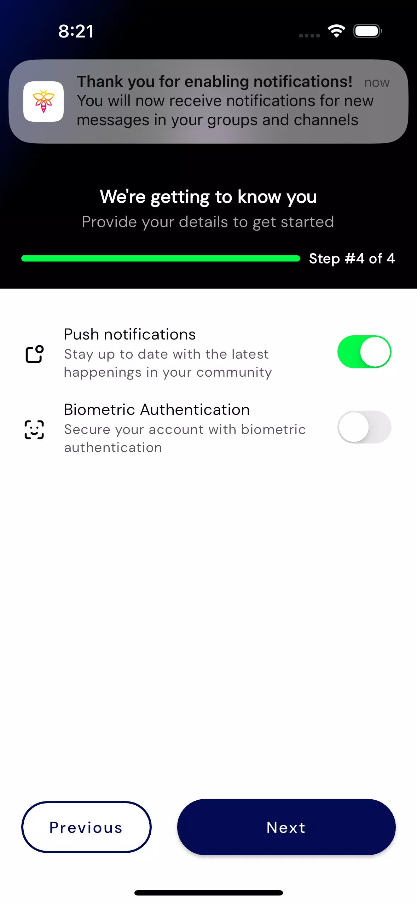

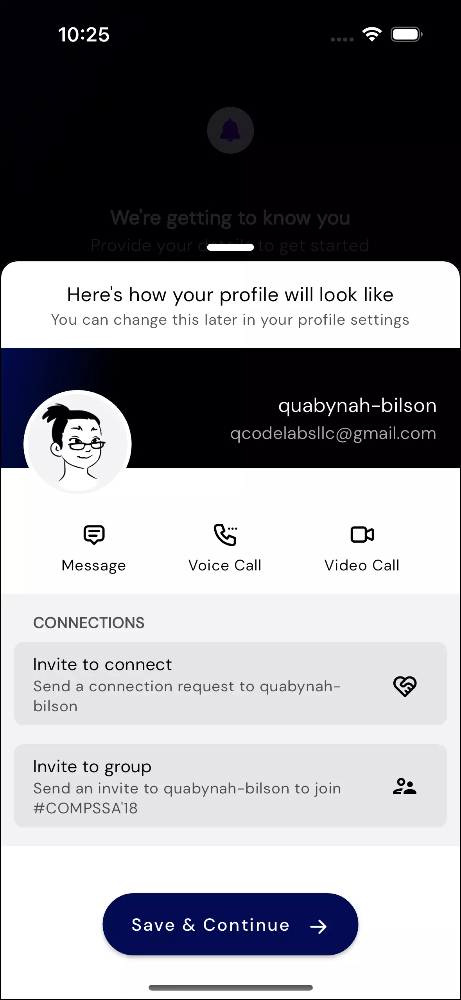

### Home

 

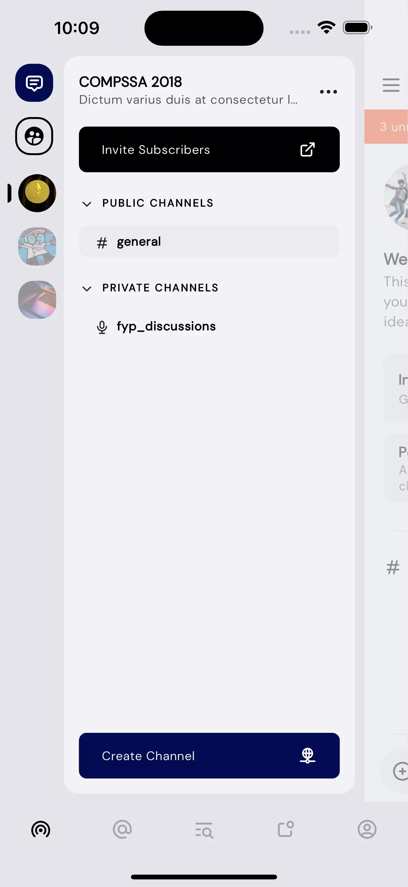

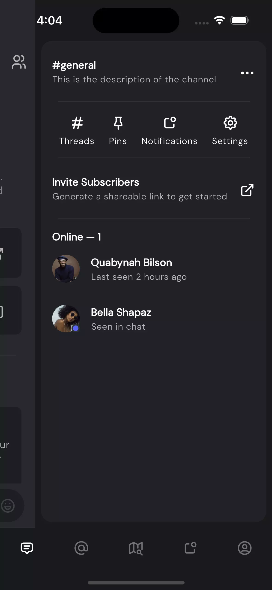

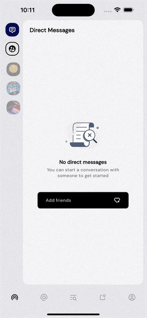

 

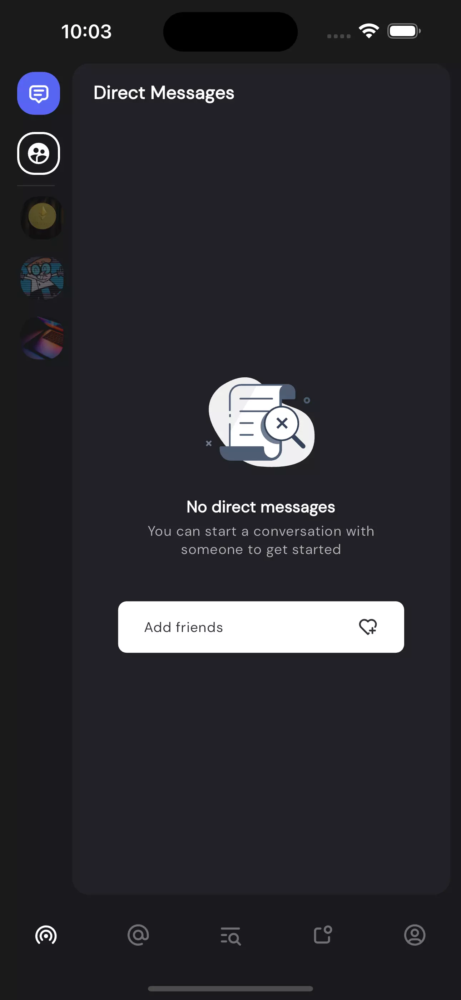

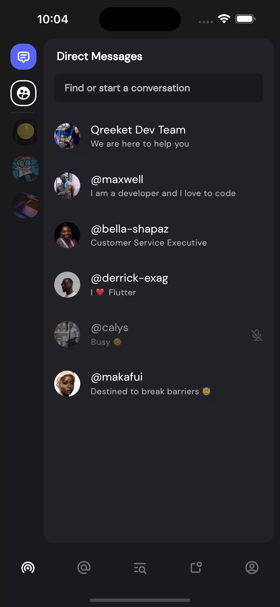

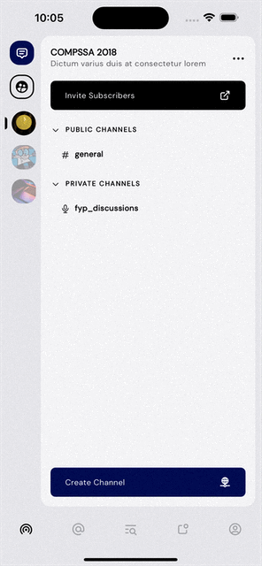

 

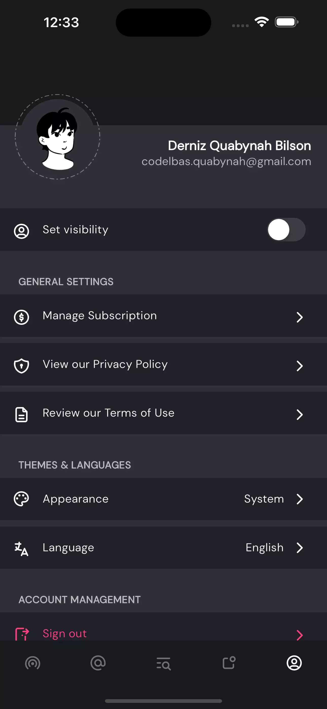

[//]: # (

)
[//]: # ()
[//]: # (

)
[//]: # ()

